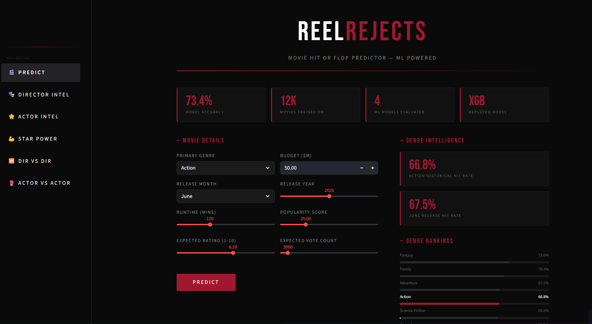
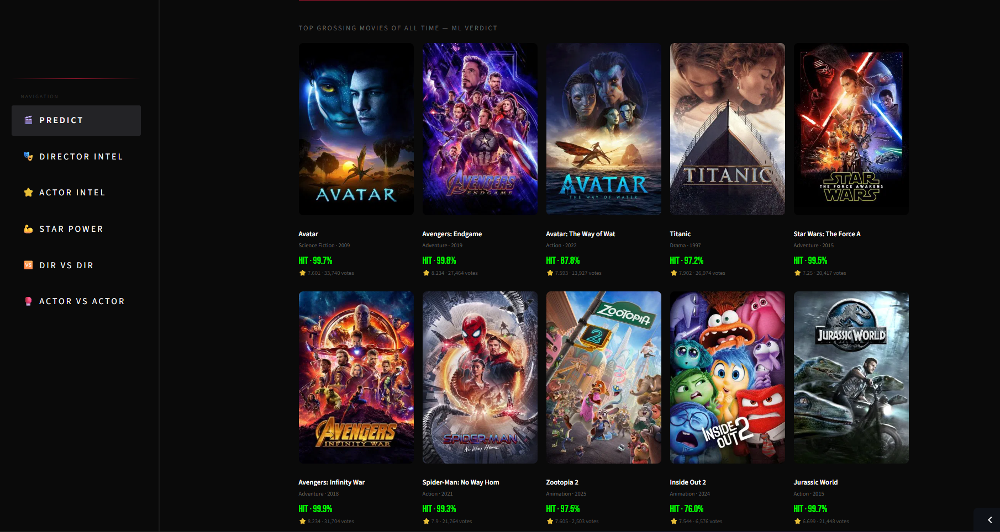
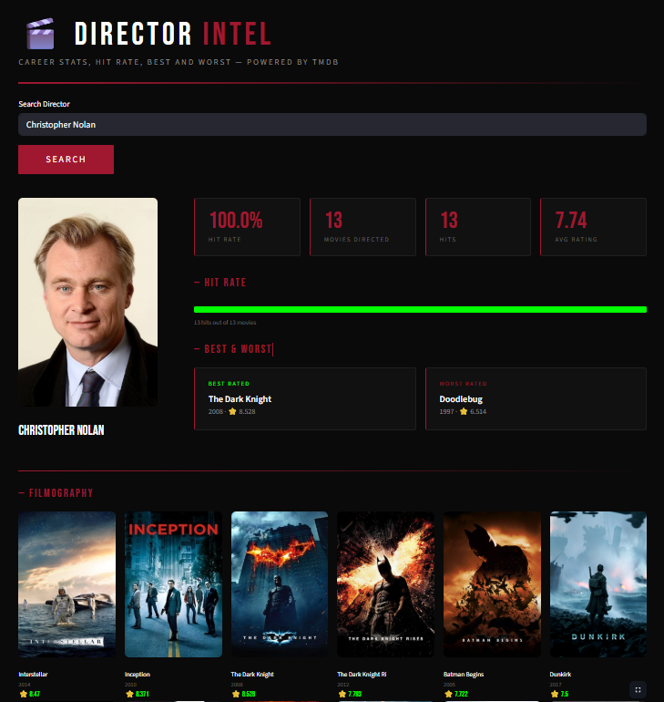
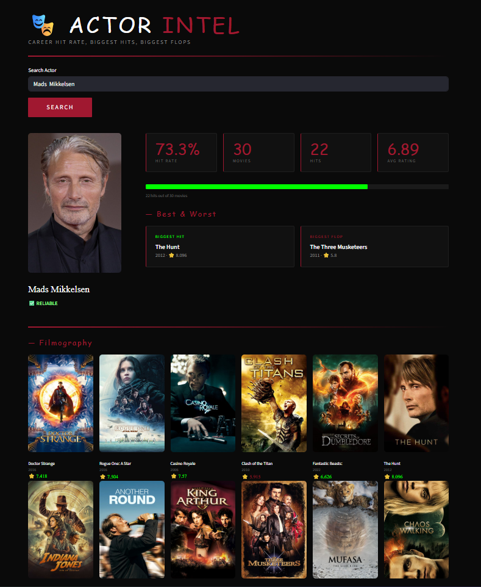
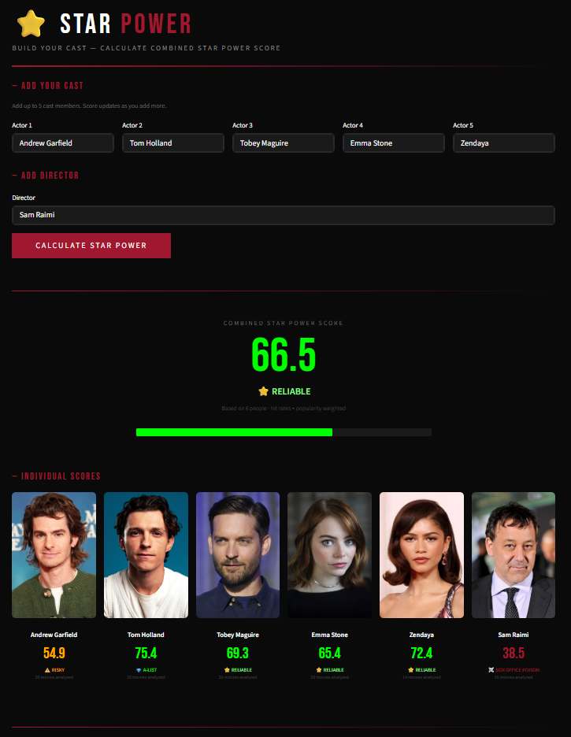
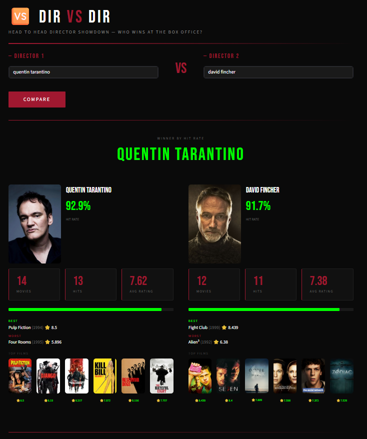
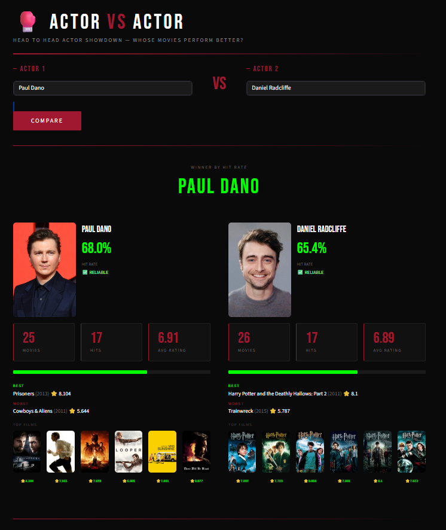
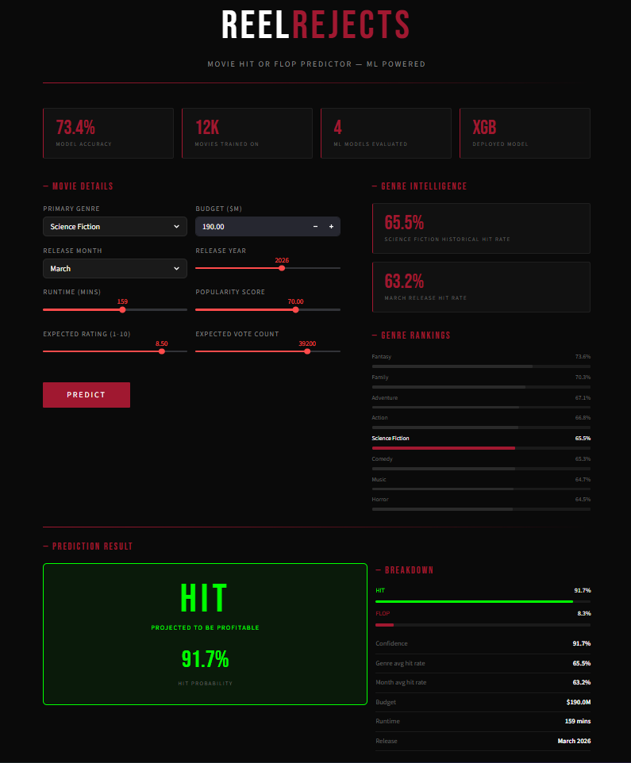

<div align="center">



# 🎟️ REEL**REJECTS**
### *Movie Hit or Flop Predictor — ML Powered*

[](https://python.org)
[](https://streamlit.io)
[](https://xgboost.readthedocs.io)
[](https://themoviedb.org)
[](https://reelrejects.streamlit.app)

**Will your movie make money — or lose it all?**  
ReelRejects uses machine learning trained on 12,000+ real movies to predict box office success before a film releases.

[🚀 **Live Demo**](https://reelrejects.streamlit.app) · [📊 **Notebooks**](notebooks/) 

</div>

---

## 🎬 What is ReelRejects?

ReelRejects is a full-stack ML web application that predicts whether a movie will be a commercial **HIT** or **FLOP** before it releases. Input budget, genre, release month and the model returns a probability score with confidence level — backed by data from 12,188 real movies.

Beyond prediction, it's a full movie intelligence platform powered by the TMDB API:

| Page | What it does |
|------|-------------|
| 🎬 **Predict** | Hit/Flop probability with genre & month intelligence |
| 🏆 **Hall of Fame** | Top 30 grossing movies with ML verdict |
| 💀 **Hall of Shame** | 30 certified flops with actual loss data |
| 🎭 **Director Intel** | Career hit rate, best/worst film, filmography |
| ⭐ **Actor Intel** | Box Office Poison vs A-List badges |
| 💪 **Star Power** | Combined cast score from up to 5 actors |
| 🆚 **Dir vs Dir** | Head-to-head director showdown |
| 🥊 **Actor vs Actor** | Head-to-head actor career comparison |

---

## 📸 Screenshots

<div align="center">

<table>
<tr>
<td width="50%"><br/><sub><b>Prediction Form + Genre Intelligence</b></sub></td>
<td width="50%"><br/><sub><b>Hall of Fame — Top Grossing Movies</b></sub></td>
</tr>
<tr>
<td width="50%"><br/><sub><b>Director Intel — Christopher Nolan (100% hit rate)</b></sub></td>
<td width="50%"><br/><sub><b>Actor Intel — Career Stats & Badges</b></sub></td>
</tr>
<tr>
<td width="50%"><br/><sub><b>Star Power Calculator</b></sub></td>
<td width="50%"><br/><sub><b>Dir vs Dir — Tarantino vs Fincher</b></sub></td>
</tr>
<tr>
<td width="50%"><br/><sub><b>Actor vs Actor — Head to Head</b></sub></td>
<td width="50%"><br/><sub><b>Prediction Result — HIT 91.2%</b></sub></td>
</tr>
</table>

</div>

---

## 🧠 ML Models

4 models trained and evaluated on 12,188 movies from the TMDB dataset:

| Model | Accuracy | Status |
|-------|----------|--------|
| Logistic Regression | 68.13% | Baseline |
| Random Forest | 72.72% | — |
| **XGBoost** | **73.42%** | ✅ **Deployed** |
| Neural Network | 71.21% (74.98% val peak) | Deep Learning |

**Target variable:** ROI = revenue / budget. Hit if ROI > 1.

**Top features (XGBoost):**
```
vote_count      27.66%  ████████████████████████████
release_year    14.73%  ██████████████
log_budget      11.68%  ███████████
runtime         10.38%  ██████████
vote_average    10.17%  ██████████
```

---

## 📊 Key EDA Findings

- **62.2% hits**, 37.8% flops across 12,188 movies
- Hits have **70% higher avg budget** ($23.7M vs $13.9M)
- **Fantasy (73.6%)** and **Family (70.3%)** are safest genres
- **Documentary (48.1%)** is riskiest
- Best release months: **July (69.4%)**, June (67.5%)
- Worst: **September (53.9%)**
- Hits run **15 mins longer** on average (102 vs 87 mins)
- Hits have **2x higher popularity** score (19.95 vs 9.47)

---

## 🗂️ Project Structure

```
ReelRejects/
├── app.py                    # Main app — prediction + Hall of Fame
├── pages/
│   ├── Director_Intel.py     # Director career stats
│   ├── Actor_Intel.py        # Actor career stats
│   ├── Star_Power.py         # Cast star power score
│   ├── Dir_vs_Dir.py         # Director head-to-head
│   └── Actor_vs_Actor.py     # Actor head-to-head
├── models/
│   ├── reelrejects_model.pkl # XGBoost model
│   ├── genre_encoder.pkl     # LabelEncoder
│   └── feature_cols.pkl      # Feature column order
├── notebooks/
│   ├── ReelRejects_EDA.ipynb
│   ├── ReelRejects_Models.ipynb
│   └── ReelRejects_DeepLearning.ipynb
├── ss/                       # Screenshots
├── .env                      # TMDB_API_KEY (not committed)
└── requirements.txt
```

---

## ⚙️ Tech Stack

| Layer | Tech |
|-------|------|
| **ML** | XGBoost, Scikit-learn, TensorFlow/Keras |
| **Data** | Pandas, NumPy |
| **UI** | Streamlit (dark theme, custom CSS) |
| **API** | TMDB API v3 |
| **Deployment** | Streamlit Cloud |
| **Notebooks** | Jupyter |

---

## 🚀 Run Locally

```bash
# Clone
git clone https://github.com/cryosleeperX20/ReelRejects
cd ReelRejects

# Install dependencies
pip install -r requirements.txt

# Add your TMDB API key
echo "TMDB_API_KEY=your_key_here" > .env

# Run
streamlit run app.py
```

Get a free TMDB API key at [themoviedb.org](https://www.themoviedb.org/settings/api)

---

## 📦 Requirements

```
streamlit
python-dotenv
requests
numpy
scikit-learn
xgboost
tensorflow
pandas
plotly
```

---

## 📁 Dataset

**TMDB Movies Dataset v11** — [Kaggle](https://www.kaggle.com/datasets/asaniczka/tmdb-movies-dataset-2023-930k-movies)  

---
